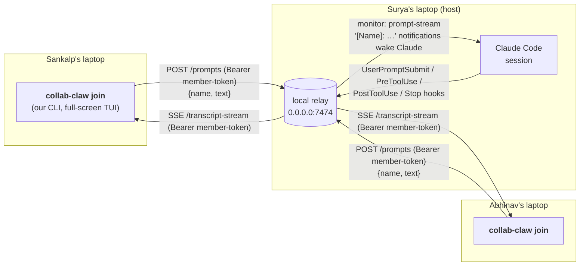

# collab-claw — Build Plan (v1, post-Codex review)

This revision applies the Codex review of the prior CLI-joiner pivot. Key corrections: marketplace layout fixed; SKILL frontmatter and slash-command auto-invocation locked down; host instructions pinned in `skills/host/SKILL.md` (no separate agent file); explicit member/host token auth on the relay; `PreToolUse` added to hooks; honest documentation of "chunky" event streaming (no token streaming).

v1 ships **two artifacts**:

1. A **`collab-claw` CLI** (npm + Homebrew) that joiners install and run as `collab-claw join <url>`. CLI-native, full-screen TUI. No Claude Code on the joiner side at all.
2. A **`collab-claw` Claude Code plugin** (official marketplace) that hosts install. Provides slash commands, hooks, and one host monitor that wires Claude into the room.

Both artifacts share one Node codebase. The CLI is the product surface; the plugin is a thin shim that delegates to the CLI.

## 1. The decision in one paragraph

`collab-claw` is a small Node CLI plus a thin Claude Code plugin. Hosts run Claude Code with the plugin; their hooks broadcast every prompt, every tool start, every tool result, and every final assistant response to a local Node relay, and one host-only plugin monitor delivers joiner prompts back into Claude as `[Name]: …` notifications. Joiners don't run Claude Code — they install the `collab-claw` CLI and run `collab-claw join <url>`, which opens a Claude-Code-flavored TUI: scrolling transcript above, prompt at the bottom. Typed prompts POST to the host's relay (with a member token); transcript events stream back via SSE. Zero joiner tokens because there's no joiner Claude. Local-first by default (relay binds to `0.0.0.0:7474`); cross-network is opt-in via `/collab-claw:expose` (Cloudflare quick tunnel, free, no account). No `claude.ai` OAuth, no `--dangerously-*` flags, no Pro/Max gate.

## 2. Mental model



Three things to notice:

1. **No Claude on the joiner side, ever.** Joiners run our CLI, which talks HTTP+SSE to the host's relay. Zero tokens, zero context pollution, zero Claude Code installation requirement.
2. **One host-side monitor.** Surya's plugin runs a single always-on monitor that delivers `[Name]: …` lines as model input. The monitor checks `~/.collab-claw/session.json` on each tick: if no room is active it idles silently (no model input); if a room is active it streams joiner prompts. This is the one place we use monitor-as-model-input — exactly what it was designed for. (Spike B finding F1: the docs-suggested `"when": "on-skill-invoke:host"` is silently broken in Claude Code 2.1.119, so we gate by session-state in the monitor process itself instead.)
3. **One CLI codebase, two surfaces.** The plugin's bin scripts (`collab-ctl host`, etc.) are bash shims into the same `collab-claw` binary that joiners run. Different subcommands, same Node project.

## 3. Streaming semantics — what joiners actually see, when

This is the truth about latency, because the previous plan over-promised. The hook events Claude Code exposes (`UserPromptSubmit`, `PreToolUse`, `PostToolUse`, `Stop`) fire at four discrete moments per turn, not on every token. So joiner experience is:

| Moment in host's turn         | Hook               | Joiner sees                                                              |
| ----------------------------- | ------------------ | ------------------------------------------------------------------------ |
| Host types and submits        | `UserPromptSubmit` | `Surya (host)` event with the prompt body                                |
| Host's Claude requests a tool | `PreToolUse`       | `▸ Claude wants to run <Tool> · <summary>` — *not yet executing*         |
| Tool finishes                 | `PostToolUse`      | The same line resolves to `✓ <Tool> · <duration>` or `✗ <Tool> · <reason>` |
| Host's Claude finishes turn   | `Stop`             | The final assistant response as a single block                           |

A subtle but important detail: `PreToolUse` fires **before** the host's permission prompt resolves. From the joiner's perspective, that means a `PreToolUse` event represents intent ("Claude wants to run this") rather than execution. The TUI deliberately uses "wants to run" / `▸` glyph for this state so joiners don't think a command is already executing while the host is still approving it. The line resolves into `✓` / `✗` only when `PostToolUse` lands.

If `PostToolUse` doesn't arrive within ~30 seconds (host denied permission, or the tool was canceled), the entry decays to a dimmed `· canceled` state. v1 doesn't have a dedicated "tool-canceled" hook to make this exact; the timeout heuristic is the v1 cover.

Between events there are gaps: between `PreToolUse` and `PostToolUse` (the tool is in flight or pending approval), and between `PostToolUse` and the next event (Claude is deciding its next move). The TUI fills these with a `⠼ Claude is working…` spinner.

What joiners do **not** see in v1:
- Token-by-token streaming of the assistant's response. Claude Code doesn't expose a hook for assistant text deltas.
- Internal reasoning that doesn't manifest as a tool call.

This is "live but chunky" streaming. For a pair-coding UX it's actually pretty natural — closer to watching Slack thread updates than to watching someone type — and it costs us nothing in fidelity that matters for collaboration. The README documents it explicitly so first-run users aren't surprised. Token streaming is a v1.x research item gated on Claude Code growing a hook for it.

## 4. Three pre-build spikes (gating)

These run **before** the rest of the build. Each is a one-evening experiment.

### Spike A — Host `UserPromptSubmit` broadcast from a marketplace-installed plugin

**Goal:** Confirm a plugin distributed via the public marketplace can register a `UserPromptSubmit` hook that POSTs the prompt to a local HTTP endpoint and exits 0 (does NOT block — host's Claude processes the prompt normally).

**Pass criteria:** type a prompt, see the prompt body POSTed, Claude processes it normally; multi-line and special-character bodies preserved.

**If it fails:** localize via `--plugin-dir` to confirm whether the issue is marketplace-specific.

### Spike B — Production-path host monitor wakes idle Claude ✅ PASSED 2026-04-26

**Status:** passed. See `SPIKE_B_RESULTS.md` for the full write-up. Two findings carried back into this plan:

- **F1.** `"when": "on-skill-invoke:host"` is silently broken in Claude Code 2.1.119 (no log entry, no monitor process, even though the manifest validates and the binary contains the format strings). v1 uses an always-on monitor gated by `~/.collab-claw/session.json` instead — see §5.6 / §5.9. This is robust to future fixes of the trigger field too.
- **F5.** The `monitors` field must be a **top-level array inside `plugin.json`**. A separate `plugin/monitors/monitors.json` file is silently ignored (older docs are stale).

The central question — *does an idle Claude session wake on a `[Name]: …` line emitted by a plugin monitor and treat it as a new user prompt?* — was answered yes. Claude wrote the requested hello-world Python script in response to a synthetic `[Sankalp]: …` emit with no prior turns in the session.

### Spike C — CLI joiner end-to-end

**Goal:** Confirm `collab-claw join <url>` connects to a relay, joins a room, sends prompts that arrive on the host within ~1s on the same Wi-Fi, and renders streamed transcript events back through SSE — with zero Claude Code on the joiner side.

**Setup:**
- Laptop X runs a stripped-down 50-line `relay.mjs` (no auth gate, hard-coded room).
- Laptop X has a tiny terminal loop that tails `/prompt-stream` and echoes back via `/events`.
- Laptop Y runs a prototype `collab-claw join http://X:7474/r/test`.

**Test cases:**
1. **Round trip:** type "hello world" on Y, see it on X within 1s; reply on X, see it on Y within 1s.
2. **Backfill:** Ctrl+C the CLI on Y mid-session, restart 30s later. Expect: `/recent` returns missed events.
3. **Network drop:** disconnect Y's wifi for 30s, reconnect. Expect: SSE re-syncs via `/recent`, no events lost.
4. **Two joiners:** laptop Z also joins; transcript stays consistent across all three machines.
5. **Clean exit:** Ctrl+C exits cleanly, restores screen buffer, posts a leave event.

**Pass criteria:** all five pass; laptop Y has no Claude Code installed at any point.

**If it fails:** fix the relay or the CLI before continuing. None of the rest of the build depends on Claude Code primitives changing.

## 5. Architecture & components

### 5.1 Repository layout (Codex correction applied)

```
collab-claw/
├── .claude-plugin/
│   └── marketplace.json         # the marketplace catalog (repo doubles as marketplace)
├── plugin/                      # the plugin itself
│   ├── .claude-plugin/
│   │   └── plugin.json          # plugin manifest
│   ├── hooks/hooks.json
│   ├── skills/
│   │   ├── host/SKILL.md
│   │   ├── approve/SKILL.md
│   │   ├── kick/SKILL.md
│   │   ├── expose/SKILL.md
│   │   ├── status/SKILL.md
│   │   ├── leave/SKILL.md
│   │   └── end/SKILL.md
│   └── bin/
│       ├── collab-ctl           # → exec collab-claw "$@"
│       ├── prompt-submit        # bash shim → collab-claw _hook prompt-submit
│       ├── pre-tool-use
│       ├── post-tool-use
│       ├── stop
│       ├── session-start
│       └── monitor-prompts
├── package.json                 # the npm package, "bin": { "collab-claw": "./dist/cli.mjs" }
├── tsconfig.json
├── src/
│   ├── cli.ts                   # entry point: dispatches subcommands
│   ├── commands/
│   │   ├── join.ts              # joiner TUI
│   │   ├── watch.ts             # read-only TUI variant
│   │   ├── host.ts              # invoked by plugin
│   │   ├── approve.ts
│   │   ├── kick.ts
│   │   ├── expose.ts
│   │   ├── status.ts
│   │   ├── leave.ts
│   │   ├── end.ts
│   │   └── _hook.ts             # entry for plugin hook scripts
│   ├── relay/
│   │   ├── server.ts
│   │   ├── auth.ts              # token mint/verify
│   │   ├── rooms.ts
│   │   └── ringbuffer.ts
│   ├── tui/
│   │   ├── render.ts
│   │   ├── input.ts
│   │   ├── markdown.ts          # tiny markdown+code renderer
│   │   └── theme.ts
│   ├── monitor/
│   │   └── prompts.ts
│   ├── state.ts                 # ~/.collab-claw/{config,session}.json helpers
│   └── transport/
│       ├── http.ts
│       └── sse.ts
├── README.md
├── LICENSE
├── PLAN.md / VISION.md / SPIKES.md
└── Formula/collab-claw.rb       # Homebrew tap formula
```

The repo-root `.claude-plugin/marketplace.json` is the catalog. It contains a single plugin entry whose `source` is `./plugin`. Users do `/plugin marketplace add collab-claw/collab-claw` (the GitHub repo), which loads the catalog; then `/plugin install collab-claw@collab-claw` resolves to `./plugin/.claude-plugin/plugin.json`. There is no `marketplace.json` inside `plugin/`.

The plugin's `bin/` files are tiny bash shims that call the npm-installed `collab-claw` binary. Plugin install requires `collab-claw` to be on `$PATH`; `session-start` checks for it and prints a one-line install hint if missing.

### 5.2 The CLI (`collab-claw`)

User-facing tool. Subcommands:

| Subcommand                     | Audience    | What it does                                                         |
| ------------------------------ | ----------- | -------------------------------------------------------------------- |
| `collab-claw join <url>`       | joiner      | Open the full-screen TUI: backfill via `/recent`, subscribe to `/transcript-stream`, send typed prompts to `/prompts`. |
| `collab-claw watch <url>`      | spectator   | Same TUI but read-only. |
| `collab-claw host`             | host (via plugin) | Spawn the relay subprocess, mint a room secret + host token, print the URL. |
| `collab-claw approve <req>`    | host (via plugin) | Approve a pending join request. The relay resolves the joiner's `/wait` long-poll directly with their member token; the host sees only `Approved <name>.` (see §5.5). |
| `collab-claw kick <name>`      | host (via plugin) | Revoke a member. Invalidates their member token. |
| `collab-claw expose`           | host (via plugin) | Spawn `cloudflared`; rebroadcast the public URL. |
| `collab-claw status`           | both        | Print room URL, members, last 5 events, tunnel state. |
| `collab-claw leave`            | joiner      | Send leave event, clean up state file, exit. |
| `collab-claw end`              | host (via plugin) | Close room, kill relay, kill tunnel. |
| `collab-claw set-name <name>`  | both        | Persist display name to `~/.collab-claw/config.json`. |
| `collab-claw _hook <name>`     | plugin      | Internal entry point for the plugin's `hooks/hooks.json` shims. Not meant for direct human use. |

### 5.3 The TUI (`collab-claw join`)

Raw ANSI, no heavy framework. Two regions: scrolling transcript above, persistent prompt at the bottom.

```
┌─ collab-claw  4f3a8b  ·  3 members  ·  ● live ─────────────────────────┐
│                                                                          │
│ Surya  (host)                                                            │
│   hey can you scaffold a Next.js app in ./web?                           │
│                                                                          │
│ Claude                                                                   │
│   ✓ Bash  ·  pnpm create next-app web                  · 2.4s            │
│   ✓ Edit  ·  web/src/app/page.tsx                      · 1 file changed  │
│                                                                          │
│   Sure — I created a Next.js 14 scaffold under web/ with the app         │
│   router, Tailwind, and ESLint configured. Try `pnpm dev` from web/.     │
│                                                                          │
│ Sankalp  (you)                                                           │
│   please add a TODO list page using shadcn                               │
│                                                                          │
│ Claude  →  Sankalp                                                       │
│   ✓ Bash  ·  npx shadcn@latest add card checkbox       · 4.1s            │
│   ✓ Edit  ·  web/src/app/todo/page.tsx                 · 53 lines        │
│                                                                          │
│   Added /web/todo with shadcn's <Card> and <Checkbox>. State's in-       │
│   memory for now — let me know if you want persistence.                  │
│                                                                          │
│ Sankalp  (you)                                                           │
│   nice. now wire it up to a real DB                                      │
│                                                                          │
│ Claude  →  Sankalp                                                       │
│   ▸ Claude wants to run Bash · pnpm add prisma sqlite3                   │
│   ⠼ Claude is working…                                                   │
│                                                                          │
├──────────────────────────────────────────────────────────────────────────┤
│  Sankalp @ 4f3a8b                                                        │
│  >  _                                                                    │
└──────────────────────────────────────────────────────────────────────────┘
```

Implementation:

- Enter the alternate screen buffer (`\x1b[?1049h`); restore on exit.
- **Status header:** room ID, member count, connection state (`● live` / `◌ reconnecting…` / `× disconnected`), identity badge.
- **Transcript region:** event log. Each event has a name attribution line in the speaker's color, then indented body content. Markdown rendered (code blocks, lists, bold, inline code).
- **Tool-call rendering, two-phase:**
  - On `PreToolUse`: render `▸ Claude wants to run <Tool> · <summary>` in a muted color. The wording deliberately reflects intent — the host's permission prompt may not have resolved yet.
  - On `PostToolUse`: rewrite that line in place to `✓ <Tool> · <summary> · <duration>` (success) or `✗ <Tool> · <summary> · <reason>` (failure).
  - If no `PostToolUse` arrives within ~30s, decay the line to a dimmed `· canceled` state.
- **Working spinner:** `⠼ Claude is working…` shows when we've seen a `PreToolUse` since the last terminal `Stop`.
- **Prompt region:** persistent multi-line input. Enter sends; Shift+Enter (Alt+Enter fallback) inserts newline.
- **Slash commands at the joiner prompt:** `/leave`, `/help`, `/status`, `/clear` (clears local view; transcript remains on relay), `/who`. Slash-command popup as you type, mirroring Claude Code's UX.
- **Ctrl+C:** confirm-then-exit; sends `leave`, restores screen buffer.
- **Resize:** re-render on `SIGWINCH`.

The reference for look-and-feel is Claude Code itself.

### 5.4 The relay (`src/relay/`)

Node, zero npm deps. Binds to `0.0.0.0:<relayPort>`. Endpoints:

| Method  | Path                                | Auth required             | Used by                       |
| ------- | ----------------------------------- | ------------------------- | ----------------------------- |
| `POST`  | `/rooms/:room/join-requests`        | URL fragment `secret`     | CLI `join` (handshake)        |
| `GET`   | `/rooms/:room/join-requests/:id/wait` | request_id (single-use) | CLI `join` (long-poll for token) |
| `POST`  | `/rooms/:room/approvals`            | host token                | host approve                  |
| `POST`  | `/rooms/:room/kicks`                | host token                | host kick                     |
| `DELETE`| `/rooms/:room`                      | host token                | host end                      |
| `POST`  | `/rooms/:room/prompts`              | member token              | CLI `join`                    |
| `POST`  | `/rooms/:room/events`               | host token                | host hook scripts             |
| `GET`   | `/rooms/:room/transcript-stream`    | member token              | CLI `join`/`watch` (SSE)      |
| `GET`   | `/rooms/:room/prompt-stream`        | host token                | host monitor (SSE)            |
| `GET`   | `/rooms/:room/recent`               | member token              | CLI on connect / reconnect    |
| `GET`   | `/rooms/:room/members`              | member token              | CLI `status`                  |
| `POST`  | `/rooms/:room/leaves`               | member token              | CLI `leave`                   |

**Every** authenticated endpoint — including the SSE streams — takes its token in the `Authorization: Bearer <token>` header. v1's CLI consumes SSE using Node's `fetch` plus a streaming-body parser (not the browser `EventSource` API), which means custom headers work natively. We deliberately avoid `?token=…` query-string auth because tokens in URLs leak too easily into logs, terminal scrollback, and proxy traces.

The `/join-requests/:id/wait` endpoint is the one exception: it's authenticated by possession of the (single-use) `request_id` returned from `POST /join-requests`. It's a long-poll: it blocks until the host approves (or rejects, or times out at 5 minutes), then returns `{ member_token, member_id, room_id, name }` directly to the joiner CLI — see §5.5 for why this matters.

State is in-memory only. Lifetime is the host's `claude` session (the relay subprocess dies when `claude` exits or `/collab-claw:end` runs).

### 5.5 Auth model

Two important properties: tokens are token-based (not URL-secret-based), and **no member token ever travels through the host's plugin, hooks, Claude transcript, or terminal output**. The relay mints tokens, stores them, and hands them only to the entity they belong to.

1. **At `/host` time:** `collab-claw host` mints a 32-byte room secret and a 32-byte host token. The room URL embeds the secret in the URL fragment (`#secret=…`). The host token is written to `~/.collab-claw/session.json` (mode 0600) and used by the plugin's `bin/` shims when calling the relay.

2. **`POST /join-requests`:** body is `{ name, secret }`. The relay verifies the secret and creates a *pending* membership with a freshly minted single-use `request_id`. It returns `{ request_id }` to the joiner CLI immediately. It also broadcasts a `{kind:"join-request", name, request_id}` event:
   - Over `/transcript-stream` so any existing members see "Sankalp wants to join."
   - Over `/prompt-stream` so the host monitor surfaces it to the host's Claude as `[collab-claw] Sankalp wants to join. /collab-claw:approve <request_id>`.

3. **Joiner CLI long-polls `/join-requests/:request_id/wait`:** authenticated by possession of the `request_id`. The connection blocks server-side. The joiner's TUI shows "waiting for host approval…".

4. **`POST /approvals`:** host's plugin shim sends `{ request_id }` with `Authorization: Bearer <host-token>`. The relay:
   - Verifies the host token.
   - Flips the membership to *approved* and mints a fresh 32-byte member token, **stored in relay memory only**.
   - Resolves the joiner's pending `/wait` connection with `{ member_token, member_id, room_id, name }`.
   - Returns `{ ok: true, name: "Sankalp" }` to the host's plugin. Crucially, **no token in this response.** The host's `bin/approve` script prints "Approved Sankalp." and nothing else. Nothing token-bearing ever passes through Claude's transcript, hooks, or stdout.

5. **From this point on:** the joiner's CLI uses the member token in `Authorization: Bearer …` headers on every subsequent endpoint. The URL-fragment secret is no longer used for ongoing requests; even if it leaks, it only gates `/join-requests` (which the host has to manually approve).

6. **`POST /kicks`:** invalidates the named member's token. The CLI receives a `room.kicked` SSE event and exits.

7. **Filesystem permissions are unchanged.** Surya's normal Claude permission prompts gate every file edit, regardless of which teammate's prompt triggered it.

This design has the property that the host's plugin is **only entrusted with the host token**. The host never sees member tokens — even briefly — so they can't be leaked through `--debug` output, transcript export, or session log files. The single-use `request_id` is the only short-lived secret that crosses the host boundary, and it's only useful for collecting one specific token.

### 5.6 Plugin manifest (`plugin/.claude-plugin/plugin.json`)

```json
{
  "name": "collab-claw",
  "version": "0.1.0",
  "description": "Pair-program with one Claude across multiple laptops.",
  "author": {
    "name": "collab-claw",
    "url": "https://github.com/collab-claw/collab-claw"
  },
  "homepage": "https://github.com/collab-claw/collab-claw",
  "repository": "https://github.com/collab-claw/collab-claw",
  "license": "MIT",
  "userConfig": {
    "name": {
      "type": "string",
      "title": "Display name",
      "description": "Used to prefix your prompts when hosting (e.g. 'Surya').",
      "required": true
    },
    "relayPort": {
      "type": "number",
      "title": "Local relay port",
      "description": "Port for the local relay when hosting a room.",
      "default": 7474
    }
  },
  "monitors": [
    {
      "name": "collab-claw-prompts",
      "command": "${CLAUDE_PLUGIN_ROOT}/bin/monitor-prompts",
      "description": "Joiner prompts arriving in the active collab-claw room. Each line is formatted '[Name]: <text>' and should be treated as a new user request from that named teammate."
    }
  ]
}
```

The `monitors` field must be a **top-level array inside `plugin.json`** (Spike B finding F5; verified against Claude Code 2.1.119 changelog). A separate `plugin/monitors/monitors.json` file is silently ignored. We also deliberately **omit `when`** so it defaults to `always` — Spike B finding F1 confirmed that `"when": "on-skill-invoke:host"` is silently broken in 2.1.119, and gating in-process via `~/.collab-claw/session.json` is more robust anyway (the monitor stays `bash sleep`-cheap when no room is active).

### 5.7 Marketplace catalog (`.claude-plugin/marketplace.json`)

```json
{
  "name": "collab-claw",
  "owner": { "name": "collab-claw" },
  "plugins": [
    {
      "name": "collab-claw",
      "source": "./plugin",
      "description": "Pair-program with one Claude across multiple laptops."
    }
  ]
}
```

### 5.8 Hooks (`plugin/hooks/hooks.json`)

```json
{
  "hooks": {
    "SessionStart": [
      { "hooks": [ { "type": "command", "command": "${CLAUDE_PLUGIN_ROOT}/bin/session-start" } ] }
    ],
    "UserPromptSubmit": [
      { "hooks": [ { "type": "command", "command": "${CLAUDE_PLUGIN_ROOT}/bin/prompt-submit" } ] }
    ],
    "PreToolUse": [
      { "matcher": "*", "hooks": [ { "type": "command", "command": "${CLAUDE_PLUGIN_ROOT}/bin/pre-tool-use" } ] }
    ],
    "PostToolUse": [
      { "matcher": "*", "hooks": [ { "type": "command", "command": "${CLAUDE_PLUGIN_ROOT}/bin/post-tool-use" } ] }
    ],
    "Stop": [
      { "hooks": [ { "type": "command", "command": "${CLAUDE_PLUGIN_ROOT}/bin/stop" } ] }
    ]
  }
}
```

### 5.9 Monitor script (`plugin/bin/monitor-prompts`)

The monitor declaration lives inline in `plugin.json` (see 5.6). The script itself is:

```bash
#!/usr/bin/env bash
# bin/monitor-prompts — host-only joiner-prompt streamer.
#
# Started by Claude Code at every session start (no-op when no room is active).
# Reads ~/.collab-claw/session.json. If mode != "host" or no roomId, idles cheaply.
# When a room is active, opens long-lived SSE to <relay>/prompt-stream and
# emits each joiner prompt to stdout as `[Name]: <text>`.
set -uo pipefail
SESSION="$HOME/.collab-claw/session.json"
while :; do
  if [[ -f "$SESSION" ]] && jq -e '.mode == "host" and (.roomId|length>0)' "$SESSION" >/dev/null 2>&1; then
    RELAY=$(jq -r '.relayUrl' "$SESSION")
    TOKEN=$(jq -r '.hostToken' "$SESSION")
    curl -fsSN -H "Authorization: Bearer $TOKEN" "$RELAY/prompt-stream" \
      | while IFS= read -r line; do
          [[ "$line" == data:* ]] || continue
          payload=${line#data: }
          name=$(echo "$payload"  | jq -r '.name')
          text=$(echo "$payload"  | jq -r '.text')
          echo "[$name]: $text"
        done
  fi
  sleep 5
done
```

Three properties worth noting:

- **No tokens leak through stdout.** The host token is read from disk and passed in the `Authorization` header; only the rendered `[Name]: <text>` line reaches Claude.
- **Cheap when idle.** When no room is active the script just `sleep 5`-loops; ~0% CPU.
- **No reliance on `$CLAUDE_PLUGIN_DATA` or `$CLAUDE_PLUGIN_ROOT`.** Spike B finding F3 confirmed both env vars are unset in the monitor child process (Claude Code 2.1.119 interpolates the manifest's `command` field before spawn but does not export the vars into the child's environment). All paths the script needs come from `~/.collab-claw/session.json`, which the host plugin's `bin/host` writes at `/collab-claw:host` time. The same rule applies to any future helper script the monitor spawns.

### 5.10 Hook behavior (host-only)

Hooks read `~/.collab-claw/session.json`; they short-circuit when `mode !== "host"`.

- **`bin/session-start`** — checks `collab-claw` on `$PATH`; if missing, prints a one-line `npm install -g collab-claw` hint. If `mode === "host"`, prints a status banner.
- **`bin/prompt-submit`** — host: POSTs `{kind:"prompt", name:<host>, text:<prompt>}` to `/events` (with host token). Exits 0. **Optional fallback (gated on Spike B test 4):** also outputs `additionalContext` re-stating the host instructions, in case session-long context drift is real.
- **`bin/pre-tool-use`** — host: POSTs `{kind:"tool-requested", name:<host>, payload:{tool, summary, request_id}}`. The `summary` is a one-line description of what the tool's about to do (file path for Edit, command for Bash, etc.). The `request_id` correlates this event with the eventual `tool-completed` event so the TUI can rewrite the line in place. Note: this fires *before* the host's permission prompt resolves; the relay just rebroadcasts. Joiner TUI renders this as "Claude wants to run …" rather than "running …".
- **`bin/post-tool-use`** — host: POSTs `{kind:"tool-completed", name:<host>, payload:{tool, request_id, success, duration_ms, summary, error?}}`.
- **`bin/stop`** — host: POSTs `{kind:"response", name:<host>, text:<last_assistant_message>}`.

Every hook fails open: if the relay is unreachable, log a one-liner to `${CLAUDE_PLUGIN_DATA}/hook.log` and exit 0. The user's local Claude is never broken by a relay failure.

### 5.11 Skills as deterministic-enough dispatch (Codex corrections applied)

Each `SKILL.md` has frontmatter that:
- Uses `name: host` (no `collab-claw:` namespace prefix — plugin namespacing is automatic).
- Sets `disable-model-invocation: true` so Claude doesn't auto-run `/host`, `/end`, `/kick`, etc.

Example, `plugin/skills/host/SKILL.md`:

```markdown
---
name: host
description: Start a collab-claw room and print the join URL. Use only when the user explicitly types /collab-claw:host.
disable-model-invocation: true
---

Run `collab-ctl host` via the Bash tool, exactly as written. Print the command's output verbatim. Do not summarize, edit, or take any other actions in response to running this skill.

The user can share the printed URL with teammates. Teammates join with `collab-claw join <url>` from their own terminal — they don't need Claude Code installed.

# Hosting a collab-claw room — what to do for the rest of this session

You are now hosting a collab-claw room. In addition to your own user, you may receive prompts from teammates that arrive as monitor notifications shaped like:

  [Sankalp]: <prompt text>
  [Abhinav]: <prompt text>

Treat each such notification as a new user request. Answer as you would to any other user. When your reply addresses a teammate by name, that teammate will see it streamed back into their CLI; you don't need to repeat yourself.

Permission prompts for file edits and Bash commands are still gated by the host's normal Claude Code permission flow — there is no auto-approval based on which teammate sent the prompt.
```

`collab-ctl` is a one-line shim: `#!/usr/bin/env bash` then `exec collab-claw "$@"`. Plugin `bin/` is auto-PATH'd while the plugin is enabled.

The host instructions live in the SKILL body specifically (no separate `agents/host.md`). When the user invokes `/collab-claw:host`, the SKILL body becomes part of conversation context and persists for the session. Spike B test 3 verifies this isn't compacted away over long sessions; if it is, `bin/prompt-submit` re-injects the instructions via `additionalContext` on every host turn.

Other slash-command skills (`approve`, `kick`, `expose`, `status`, `leave`, `end`) follow the same shape — `name: <verb>`, `disable-model-invocation: true`, body of "run `collab-ctl <verb>` and print verbatim." Their bodies don't carry session-spanning instructions because they're transactional.

### 5.12 Pairing handshake — joiner perspective

1. Joiner CLI: `collab-claw join <url>`. The CLI parses the URL fragment for `secret`, calls `POST /join-requests` with `{name, secret}`, gets back a `request_id`.
2. CLI calls `GET /join-requests/<request_id>/wait` (long-poll) and shows "waiting for host approval…".
3. Meanwhile, the host monitor surfaces `[collab-claw] Sankalp wants to join. /collab-claw:approve <request_id>` to the host's Claude. Host invokes `/collab-claw:approve <id>`.
4. Relay verifies the host token, flips the membership, mints a member token, and resolves the joiner's `/wait` long-poll with `{ member_token, room_id, member_id, name }`. The host's plugin only gets `{ ok: true, name }` back — no token.
5. Joiner CLI flips into the full-screen TUI, calls `/recent` (with `Authorization: Bearer <member_token>`) to backfill, opens the SSE `transcript-stream` (same Bearer header), and unlocks input.

### 5.13 LAN binding and tunneling

- Relay binds to `0.0.0.0:<relayPort>`. Same-LAN joiners use the host's auto-detected LAN IP (shown by `/collab-claw:host`).
- `/collab-claw:expose` (opt-in) spawns `cloudflared tunnel --url http://localhost:<port>` to make the same relay reachable across networks. The tunnel URL replaces the LAN URL in `session.json` and is rebroadcast to active members via a `room.url-changed` event so their CLIs auto-reconnect.

## 6. User journeys

### 6.1 Install — host

```
$ npm install -g collab-claw
$ claude
> /plugin marketplace add collab-claw/collab-claw
> /plugin install collab-claw@collab-claw
  → asked for `name`: Surya
> /reload-plugins
```

### 6.2 Install — joiner

```
$ npm install -g collab-claw
$ collab-claw set-name Sankalp
```

That's it. No Claude Code, no plugin, no marketplace.

### 6.3 Surya hosts

```
> /collab-claw:host
[collab-claw] hosting on http://192.168.1.42:7474/r/4f3a8b#secret=…
[collab-claw] same Wi-Fi: share that URL.
[collab-claw] across networks: run /collab-claw:expose for a public URL.
```

### 6.4 Sankalp joins

```
$ collab-claw join http://192.168.1.42:7474/r/4f3a8b#secret=…
[collab-claw] requesting access as Sankalp…
[collab-claw] waiting for Surya to approve…
```

Surya's Claude Code shows: `[collab-claw] Sankalp wants to join. /collab-claw:approve req-7c2`. He types it.

Sankalp's terminal flips into the full-screen TUI: backfilled transcript, prompt input at the bottom.

### 6.5 Sankalp prompts

In Sankalp's TUI:

```
> please add a TODO list page using shadcn
```

Hit Enter. The CLI POSTs `{name:"Sankalp", text:"..."}` to `/prompts` (with member token). The TUI immediately renders the `Sankalp (you)` event in the transcript region.

On Surya's machine, the host monitor surfaces `[Sankalp]: please add a TODO list page using shadcn` as a notification. Surya's Claude responds. Each `PreToolUse` and `PostToolUse` and the final `Stop` are POSTed to `/events` by the host's hook scripts. Sankalp's TUI updates per-event: tool starts, tool completions, then the final response.

Token cost on Sankalp's account: zero. He has no Claude.

### 6.6 Tearing down

- Sankalp drops out: Ctrl+C in the TUI (or `collab-claw leave`). Posts a leave event, exits the TUI, cleans up the state file.
- Surya wraps the session: `/collab-claw:end`. All members' TUIs render `[collab-claw] room closed by host` and exit cleanly.

## 7. Distribution

**Two artifacts. One source repo.**

- **CLI via npm:** `npm install -g collab-claw`. Primary path.
- **CLI via Homebrew:** `brew install collab-claw/tap/collab-claw`. The formula installs the same npm package globally.
- **Plugin via marketplace:** `/plugin marketplace add collab-claw/collab-claw && /plugin install collab-claw@collab-claw`.

The plugin's `bin/` files are bash shims that exec the npm-installed `collab-claw`. The plugin's `session-start` hook checks for `collab-claw` on `$PATH` and prints a clear install hint if missing. A failed install of the CLI does not break the host's Claude Code — it just disables the plugin's room features until they fix it.

Soft runtime deps: Node 18+, plus `cloudflared` only when `/collab-claw:expose` is run.

## 8. What's explicitly out of v1

- **Hosts on Bedrock / Vertex / Foundry** — Monitor tool unavailable.
- **Claude Code older than v2.1.105 on the host** — plugin monitors not yet supported.
- **`DISABLE_TELEMETRY` / `CLAUDE_CODE_DISABLE_NONESSENTIAL_TRAFFIC` on the host** — same Monitor constraint.
- **Joiner output inside Claude Code's transcript.** Investigated, rejected: monitors are model input.
- **A browser companion view.** Considered, rejected: foreign object in a CLI workflow.
- **Token-by-token streaming of the assistant response.** Claude Code doesn't expose a hook for it. v1.x research item.
- **Joiners with their own Claude Code session.**
- **Hosted relay.** Local-first only.
- **Channels mode.** Defer to v1.1.
- **Cursor / OpenCode / Codex adapters.** Defer to v1.3+.

## 9. Failure modes

| Failure                              | Behavior                                                                                        |
| ------------------------------------ | ----------------------------------------------------------------------------------------------- |
| Relay unreachable from CLI           | TUI shows "disconnected, retrying in Ns…" with exponential backoff. Buffered prompts replay on reconnect. |
| Joiner's network drops               | TUI reconnects, calls `/recent` for backfill, resumes streaming.                                |
| Host's relay process dies            | `session-start` re-spawns it on next session start. Active CLIs reconnect via SSE retry.        |
| `collab-claw` CLI not on host's PATH | `session-start` hook prints `npm install -g collab-claw` and disables plugin features until resolved. |
| Cloudflared dies                     | Host gets a notification; same-LAN joiners unaffected.                                          |
| Two joiners with the same name       | Relay rejects the second `/join-requests`.                                                      |
| `/collab-claw:host` invoked twice    | Idempotent: re-attaches to the existing room.                                                   |
| Claude ignores a `[Name]:` notification | Host can `> [Sankalp]: …` manually to flush, or run `bin/inject` to force-flush queue.       |
| Plugin monitor unavailable on host   | `session-start` detects missing Monitor capability, prints a clear error, refuses to host.    |
| Long-session host instruction drift  | Defer assessment to dogfooding. Mitigation if observed: `bin/prompt-submit` re-injects host instructions as `additionalContext` on every host turn. (Out of scope for spikes; trivially additive in build.) |
| Member token leaked                  | Host can `/collab-claw:kick <name>`; their token is invalidated immediately.                    |

## 10. Build order (only after all three spikes pass)

1. **Scaffold.** Repo skeleton, `package.json`, TypeScript setup, `.claude-plugin/marketplace.json`, `plugin/.claude-plugin/plugin.json`, README, LICENSE.
2. **Relay (`src/relay/`).** All twelve HTTP routes, two SSE streams, in-memory rooms with 200-event ring buffer, token mint/verify. Smoke-test with `curl`.
3. **State helpers.** `~/.collab-claw/{config,session}.json` read/write.
4. **CLI core.** `host`, `join`, `watch`, `set-name`, `status`, `leave`, `end`, `approve`, `kick`, `expose`. Plain non-TUI implementations first.
5. **TUI MVP.** Raw-ANSI full-screen renderer for `join`/`watch`, plain-text only: status bar, scrolling transcript with name attribution, two-phase tool-call rendering (`▸ wants to run` → `✓`/`✗`), persistent prompt, color, slash menu, resize. **No markdown, no syntax highlighting yet** — the goal here is "robust skeleton." A line of inline code shows as backtick-wrapped text; a code block shows as indented monospace; nothing fancy. This is the bar that has to clear end-to-end testing.
6. **Plugin shim (`plugin/`).** All SKILL.md files (correct frontmatter), hooks (corrected schema, including `PreToolUse`), monitors (corrected schema), `bin/` shims.
7. **End-to-end.** Two laptops, same Wi-Fi: host + join + prompt + tool calls + final response, all flowing on the plain TUI.
8. **TUI polish.** Markdown rendering (bold, headings, lists), code-block syntax highlighting for the common languages, smarter wrapping. Only after step 7 has been demonstrably stable. Each polish pass ships behind a single env var (e.g. `COLLAB_CLAW_RICH=1`) until it's de-risked, then becomes default.
9. **Tunneling.** `collab-claw expose` + `cloudflared` integration.
10. **Smoke tests.** Three scenarios: same machine, same Wi-Fi, cross-network via `/expose`.
11. **README + screencasts.** ~1-minute install (host vs joiner), walkthroughs, **explicit "what streaming looks like" section**, known constraints (Bedrock/Vertex/Foundry, telemetry, v2.1.105+).
12. **Homebrew tap.**
13. **Apply for the official Anthropic marketplace.**

## 11. The single technical bet, restated

The original plan had two bets. This plan had one: **Spike B** — that an idle Claude session wakes on `[Name]: …` lines emitted by a plugin monitor and treats them as new user prompts. ✅ **Confirmed 2026-04-26.** See `SPIKE_B_RESULTS.md`. The architecture works, with one trigger-mode change (`always` + session-state gate, see §5.6 / §5.9). Joiner-side guarantees ("zero tokens, no context pollution") are structural: there is no joiner Claude.

The remaining open question is **Spike C** (CLI joiner end-to-end), which is an integration test, not an architectural bet — every component in it is independently understood.
