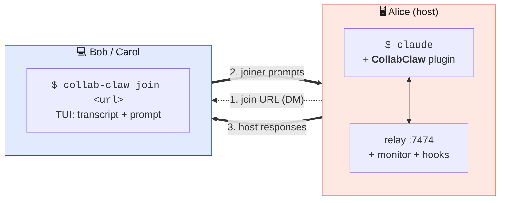

<p align="center">
  
</p>

<h1 align="center">CollabClaw 🦞</h1>

<p align="center">
  <em>Pair-program with one Claude across multiple laptops.</em>
</p>

<p align="center">
  <a href="https://www.npmjs.com/package/collab-claw"></a>
  <a href="https://github.com/sankalpgunturi/homebrew-tap"></a>
  <a href="https://github.com/sankalpgunturi/collab-claw/actions/workflows/test.yml"></a>
  <a href="https://github.com/sankalpgunturi/collab-claw/releases/latest"></a>
  <a href="./LICENSE"></a>
</p>

---

**CollabClaw** lets a group of teammates collaborate inside a **single
Claude Code session**. The host runs Claude as usual; teammates connect
from their own laptops via a small CLI. Their prompts arrive as
`[Alice]: ...` notifications and the host's Claude responds — once,
for everyone.



Only the host needs Claude Code. Only the host pays for tokens.
Local-first; cross-network is opt-in.

## Quick start

You need **Node.js ≥ 20** everywhere. The host also needs **Claude Code**.

**1. Install** (host + joiners):

```bash
npm install -g collab-claw          # or: brew tap sankalpgunturi/tap && brew install collab-claw
collab-claw set-name Alice
```

**2. Host a room** (in a Claude Code session):

```
/plugin marketplace add sankalpgunturi/collab-claw
/plugin install collab-claw
/collab-claw:host
```

Claude prints a join URL. DM it to your teammates.

**3. Join a room** (any terminal on a teammate's machine):

```bash
collab-claw join http://10.0.0.42:7474#secret=...
```

When the host runs `/collab-claw:approve <id>`, the joiner's TUI
lights up. Type prompts, hit Enter, watch Claude respond — together.

## Docs

The README is the front door. Everything else lives in [`docs/`](./docs/):

- [**docs/commands.md**](./docs/commands.md) — full CLI + slash command reference; cross-network (`expose`); transcript history.
- [**docs/architecture.md**](./docs/architecture.md) — how it works end-to-end, file tree, key design decisions.
- [**docs/configuration.md**](./docs/configuration.md) — environment variables, local files, what's stored where.
- [**docs/testing.md**](./docs/testing.md) — running the test suite.

Standard project files:

- [**CONTRIBUTING.md**](./CONTRIBUTING.md) — dev loop, branch rules, PR checklist.
- [**SECURITY.md**](./SECURITY.md) — threat model and vulnerability disclosure.
- [**CODEOWNERS**](./CODEOWNERS) — who reviews what.
- [**LICENSE**](./LICENSE) — MIT.

## License

MIT. Use it, fork it, ship it. Bugs and feature requests welcome at
[Issues](https://github.com/sankalpgunturi/collab-claw/issues).
